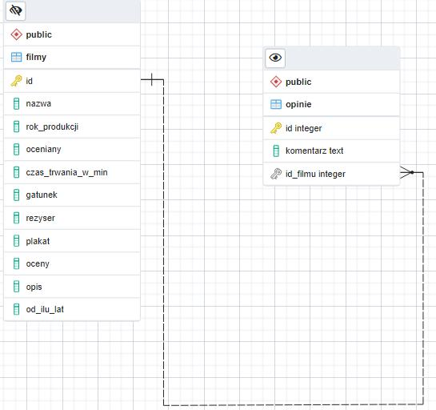
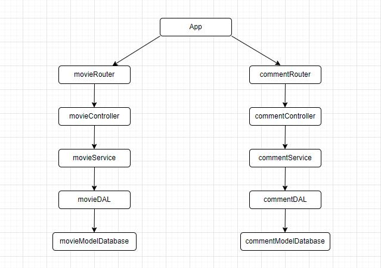
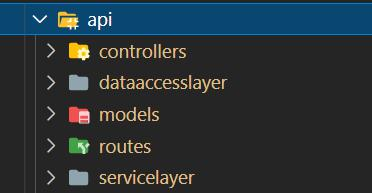
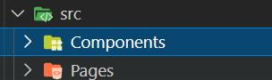

 # Dokumentacja techniczna projektu/raport 
 **1. Identyfikacja zagadnienia biznesowego**

 Aplikacja dotycząca bazy danych na temat filmów jest aplikacją będącą
 odpowiedzią na potrzeby użytkowników dotyczące prostego i przyjemnego
 przechowywania filmów oraz komentowania ich i udostępniania innym.
 Obecnie istnieje wiele serwisów takich jak, np. The Movie Database
 (TMDb), IMDb czy Netflix, jednak są one bardzo dużymi serwisami, z
 których obsługą często użytkownik nie potrafi sobie poradzić lub
 niektóre są zazwyczaj płatnymi usługami. Dzięki mojej aplikacji może
 dodawać filmy do bazy filmów, przeglądać je oraz komentować. Aplikacja
 nie jest wyczerpaniem tematu, ponieważ możliwe są dalsze usprawnienia
 i funkcjonalności takie jak, np. usprawnienie systemu komentarzy i
 ocen filmów, dodanie do konkretnego filmu z obrazem przedstawiającym
 plakat filmu czy innego rodzaju funkcjonalności, których użytkownik
 chciałby używać.

 **2. Wymagania systemowe i funkcjonalne**

 Wymagania funkcjonalne:

 Użytkownik powinien móc wyświetlić listę filmów wraz z informacjami o
 nich. Może również dodawać nowe filmy jak i je usuwać. Gdy chciałby on
 dowiedzieć się więcej o konkretnym filmie może w niego kliknąć i
 również tam będzie mógł przeglądnąć komentarze dla danego filmu, dodać
 swój komentarz, lub go usunąć.

 Wymagania techniczne:

 Backend został wykonany w Node.js z użyciem frameworka Express.
 Frontend został napisany przy użyciu biblioteki React.js wraz ze
 stylami CSS . Bazą danych będzie relacyjny system bazodanowy
 PostgreSQL. Za komunikacje miedzy backendem a bazą danych będzie
 odpowiadać Sequelize, czyli narzędzie do mapowania
 obiektowo-relacyjnego(ORM) Node.js dla PostgreSQL. Został tutaj
 również wykorzystany Git - system kontroli wersji. Aplikacja
 backendowa jest podzielona na poszczególne warstwy: router,
 controller, serviceLayer, dataAccessLayer (DAL).

 **3. Harmonogram prac**

1)  Stworzenie backendu do operowania na funkcjach związanych z filmami,
    potrzeba tutaj api umożliwiającego listowanie filmów(lub konkretnego
    filmu), dodawanie filmu, modyfikowanie go lub usuwanie (2MD)

2)  Stworzenie backendu do operowania na funkcjach związanych z
    komentarzami, potrzeba tutaj api umożliwiającego listowanie
    komentarz dodawanie komentarza lub usuwanie go (1MD)

3)  Stworzenie bazy danych oraz przetestowanie połączenia bazy z
    działającym backendem (1MD)

4)  Stworzenie frontendu jako strony z przeglądaniem filmów, usuwaniem
    ich oraz z linkami do poszczególnych operacji (2MD)

5)  Utworzenie strony z dodawanie filmów(1MD)

6)  Utworzenie strony, gdzie będzie widoczny konkretny film, będzie tu
    możliwość zmodyfikowania konkretnego filmu jak również sprawdzenia
    sekcji komentarzy, dodania nowego komentarza oraz usunięcie
    komentarza (2MD)

7)  Finalne poprawki oraz testowanie (1MD)

 **4. Analiza zagadnienia i jego modelowanie**

 Struktura bazy danych

Struktura aplikacji backendowej

**5. Implementacja**

Backend:

Mamy tutaj funkcjonalności dotyczące filmów takie jak getAllMovies,
getOneMovie, addOneMovie, deleteMovie, updateMovie (znajdują się one w
movieRouter). Funkcje przekazywane są przez poszczególne warstwy, aż
dojdą do warstwy DAL, gdzie używają modeli zdefiniowanych w katalogu
models. Jest tutaj używany ORM do wykonywania poszczególnych operacji na
tych modelach. Funkcjonalność funkcji odpowiada ich nazwom.

Również podobnie działają funkcjonalności dotyczące komentarzy
getAllcomments, deleteOneComment, addComment.

Autentykacja z bazą znajduje się w folderze secrets.

Poniżej poszczególne foldery systemu backendowego:

Frontend:

Aplikacja Frontowa została podzielona na Strony oraz Komponenty.

Została tutaj wykorzystana biblioteka material-ui będąca zestawem
narzędzi dla interfejsu użytkownika (UI). Został tutaj też wykorzystany
axios -- klient http dla node.js w celu wysyłania requestów.

Aplikacja backendowa działa na porcie **3000**, zaś frontowa na porcie
**3010**.

**6. Podsumowanie**

Celem aplikacji było stworzenie narzędzia, które w prosty sposób zapewni
użytkownikowi dostęp do bazy filmów, przeczytanie komentarzy o danym
filmie oraz dodanie własnego komentarza. Aplikacje można łatwo
rozszerzyć o kolejne dodatkowe funkcjonalności. Teraz już wszystko
zależy od użytkownika co tak naprawdę chciałby jeszcze dodać lub co
ewentualnie chciałby zmienić.
